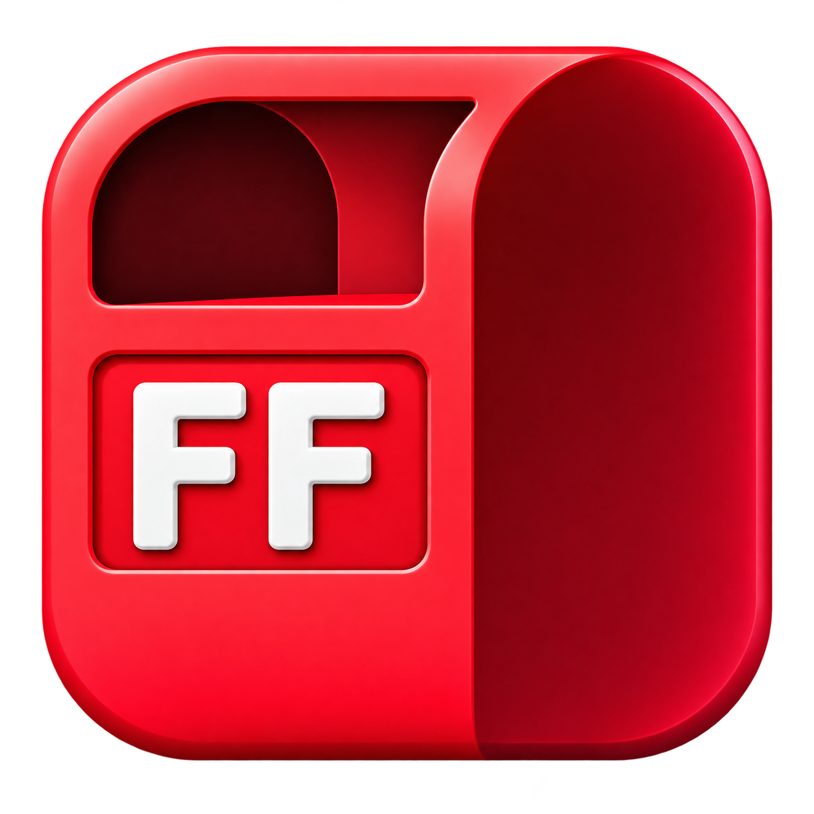

<p align="center">
  
</p>

<h1 align="center">FormFit</h1>

<p align="center">
  <strong>Train Smart. Perfect Your Form.</strong>
</p>

<p align="center">
  A fitness app that helps you learn and perform gym exercises with the correct form and technique.
</p>

---

## 🏋️ About FormFit

**FormFit** is a fitness application designed to help users learn and perform gym exercises with the correct form and technique.

The app provides detailed exercise tutorials and guidance for different muscle groups, helping users improve their workout technique, avoid common mistakes, reduce the risk of injury, and get better results from every workout.

Whether you are a beginner or an experienced gym-goer, **FormFit** helps you train smarter with proper form.

---

## ✨ Features

* 🏋️ Explore a wide range of gym exercises
* 💪 Browse exercises by muscle group
* 🎯 Learn the correct form and technique
* 📖 Step-by-step exercise instructions
* ⚠️ Learn about common mistakes to avoid
* 🔥 Beginner-friendly exercise guidance
* 🏆 Improve your workout performance

---

## 💪 Muscle Groups

FormFit includes exercises for different muscle groups:

* Chest
* Back
* Biceps
* Triceps
* Shoulders
* Legs
* Core

---

## 🎯 Our Mission

The goal of **FormFit** is to help people train smarter by focusing on one of the most important aspects of fitness: **proper exercise form**.

Good form can help users perform exercises more effectively and reduce the chances of unnecessary injuries.

---

## 🛠️ Tech Stack

> Update this section based on the technologies used in your project.

* **Frontend:** React / React Native
* **Backend:** Node.js
* **Database:** MongoDB

---

## 🚀 Getting Started

### Clone the Repository

```bash
git clone https://github.com/HarshitOnLoop/formfit.git
```

### Navigate to the Project Folder

```bash
cd formfit
```

### Install Dependencies

```bash
npm install
```

### Start the Application

```bash
npm start
```

---

## 📁 Project Structure

```text
formfit/
│
├── assets/
│   └── icon.png
│
├── src/
│
├── package.json
│
└── README.md
```

---

## 🔮 Future Features

* 📹 Exercise video tutorials
* 📊 Workout progress tracking
* 👤 User authentication
* 📝 Personalized workout plans
* 🏆 Workout history
* 🌙 Dark mode
* 🤖 AI-powered form analysis

---

## 🤝 Contributing

Contributions are welcome!

If you would like to improve FormFit, feel free to fork this repository and submit a pull request.

---

## 📄 License

This project is currently created for educational and personal use.

---

<p align="center">
  <strong>💪 Train Smart. Perfect Your Form.</strong>
</p>

<p align="center">
  Made with ❤️ for fitness enthusiasts.
</p>
